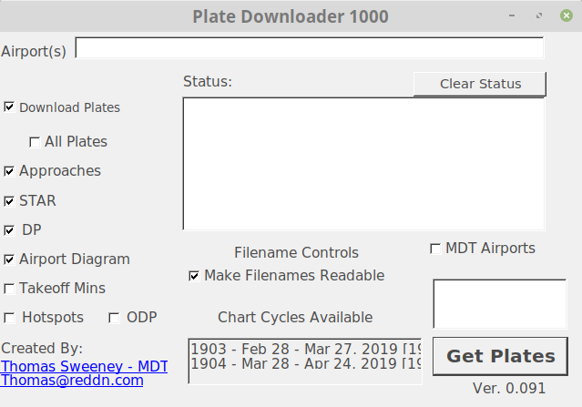

# PlateDownloader1000
downloads faa charts from a user selectable (by text) list of airports.

Built on windows .net platform

App will go 'non responsive' while downloading the 10mB XML file from the faa

Hover over some of the check marks to see some 'help' info.  

Does not work under mono due to a hard coded directory (and lacking any error catching) (TODO)

TODO: add second thread for background network (so it doesnt lock up ui)
